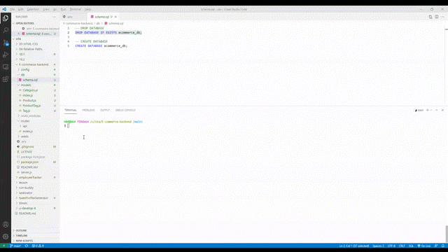
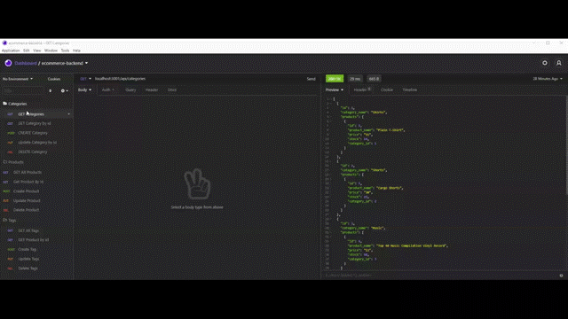
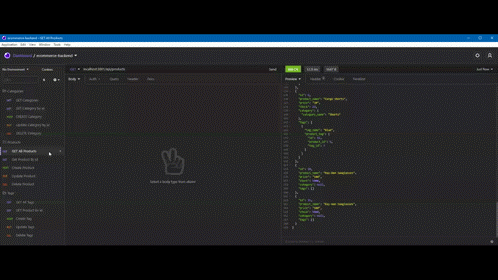

# E-commerce-Back-End Object-Relational Mapping (ORM)

### Using MySQL2, Sequelize, Express, Dotenv

<h1 align="center">E-commerce-Back-End Object-Relational Mapping (ORM)</h1>

    
    
    
    
 

Animation showing the functionality of the application:

### CRUD Categories

### CRUD Products

### CRUD Tags

